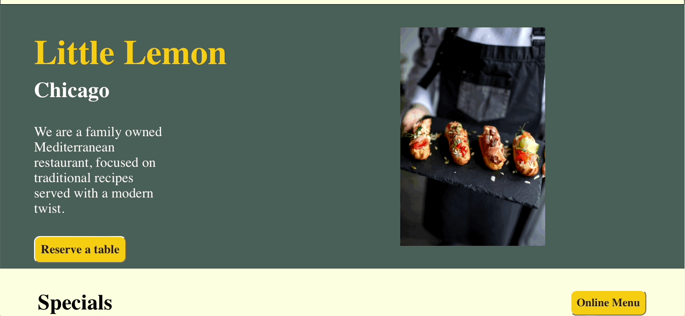

# Table Reservation Website

## Table of Contents
1. [Technology](#technology)
2. [Execution](#execution)
3. [Features](#feature)

## Technology
| Phase    | Technology |
| -------- | -------    |
| Design   | Figma      |
| Frontend | HTML/CSS + JavaScript + React + Formik + Yup + Chakra     |

## Execution
- Install React at: https://react.dev/learn/installation
- Create an empty folder, then use a code editor to open it.
- Execute: ```git clone https://github.com/william-swe/Table-Reservation-Project.git``` to clone the project.
- Change current directory to the folder with ```cd``` command.
- Execute: ```npm start```.

## Features
- A homepage with 6 sections: Navigation, Hero, Highlights, Testimonials, About, Footer. Customers can click the "Reserve" button in the "Hero" section to go to the reservation page.
- A reservation page that allows customers to choose date/time, number of guests, and occassion.
- A fill-in-form page that asks user for their name, email, and comments (optional) with client-side validation.


